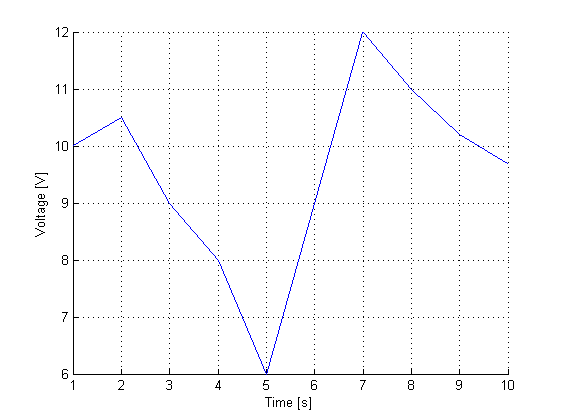

# scijsonlab : Matlab/Octave toolbox to save and plot data using scijson files

* Version : 0.1b
* License : MIT License
* Support : Matlab 2014 and after (Octave compatible)


## What's new

* 2020/05/17 - First version for Matlab.

## ToDo

* Check complex number support
* Check Octave compatibility
* Check Scilab compatibility
* Deal with string data for row and column metadata


## scijsonlab installation

1. This toolbox requires to install [jsonlab](https://github.com/fangq/jsonlab). 
Jsonlab is a Matlab toolbox dedicated to the writing and reading of json files.
2. Download the folder `scijsonlab`.
3. Copy the folder `scijsonlab` to the user MATLAB directory for a single user 
installation.
Or add the path to this folder in your Matlab path variable.
4. The example file `mainsj_test.m` in `examples` shows the usage of the main 
functions of the toolbox.

## Saving data

Saving data in a scijson file requires the following steps :     
* Create a struct with the metadata and the data using the `makesjdata` function 
for each axis of the data. The resulting struct is called a *sjdata*.
* Create a *sj collection* of *sjdata* structs using either `makesj1D`, `makesj2D` or `makesj3D` functions.
* Save the *sj collection* to a json file using the `savesj` function.

Below is an example for 1D data:
```matlab
% === 1D data === %
% data
price_value = [1 4 2 5 3 8];

% metadata and save
price = makesjdata('Price', 'euro', price_value);
price2save = makesj1D(price);
savesj('my1Ddata.json', my1Ddata_coll);
```

Below is an example for 2D data:
```matlab
% === 2D data === %
% data
time_value = 1:10; % in s
volt_value = [10 10.5 9 8 6 9 12 11 10.2 9.7]; % in V

% metadata and save
time_ = makesjdata('Time', 's', time_value);
voltage = makesjdata('Voltage', 'V', volt_value);
voltage2save = makesj2D(time_, voltage);
savesj('my2Ddata_voltage.json', voltage2save);
```

Below is an example for 3D data. Pay attention to the convention used to create,
 and store 2D array (matrix indexing):
```matlab
% === 3D data === %
% data, assuming convention row as x, col as y
% known as matrix indexing
d = [1:10];
e = 1:5;
% use ndgrid for x as row, and y as col convention
[dd,ee] = ndgrid(d, e);
score = 1./dd + 1./ee;

% metadata and save
d_sj = makesjdata('d', 'm', d);
e_sj = makesjdata('e', 'm', e);
score_sj = makesjdata('Score', 'm^-1', score);
sj3D_coll = makesj3D(d_sj, e_sj, score_sj);
savesj('my3Ddata_score.json', sj3D_coll);
```

## Loading data

A scijson file is loaded by using the function `loadjson` from the *jsonlab* 
toolbox. The returned object is a struct.

```matlab
% assuming my2Ddata_voltage.json is a scijson file
sjvoltage = loadjson('my2Ddata_voltage.json');
```

## Accessing data

The data stored in a *sjset*, is a struct with the field associated to the 
dimension of the data.

For example for a 2D *sjset* the fields are:    
* `row`
* `array`

For each field a *sjdata* struct is stored.
Then to access the data one can use the following script.

```matlab
sjvoltage = loadjson('my2Ddata_voltage.json');
x = sjvoltage.row.data;
y = sjvoltage.array.data;
```

## Basic plotting

The toolbox comes with basic plotting functions to quickly plot data saved as a *sj collection*:     
* **Grid on** by default
* **Auto label** for each relevant axis built with the *name* and *unit* field of the 
sjdata.
* **Auto logarithmic** scale for each relevant scale when data spans over more than 
one decade.
* **Scatter plot** by default to avoid misinterpretation of data.
* Automatic plotting of a SJ collection is done with `plotsj` function. This 
function choose the right graph (bar, 2D, 3D) according to the dimension of data.
* For the *N* dimensional sj collection there is a `plotsjND` function.
* For 3D plot, the user can choose to plot the following graph :
	* surface plot with `plotsj3D`
	* contour plot with `contoursj3D`
	* contour plot projected along the rows (x) with `contoursj3D_row`
	* contour plot projected along the columns (x) with `contoursj3D_col`

For example the following command plot automatically the data stored in the `voltage2save` *sj collection*. The resulting graph is shown here after.

```matlab
% plot data
figure();
plotsj2D(voltage2save);
```

